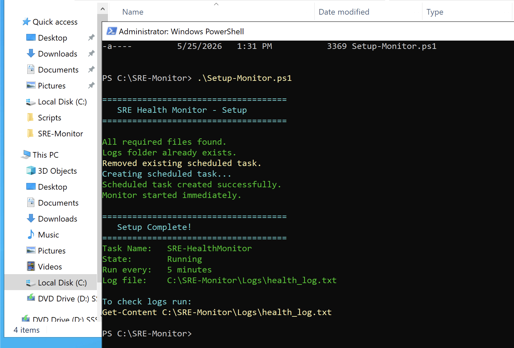
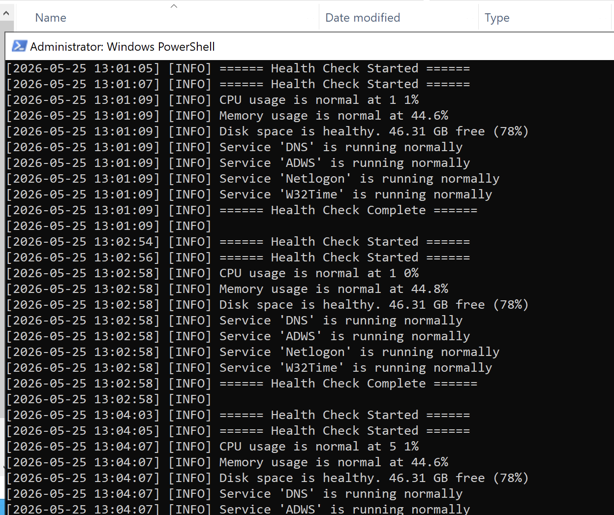
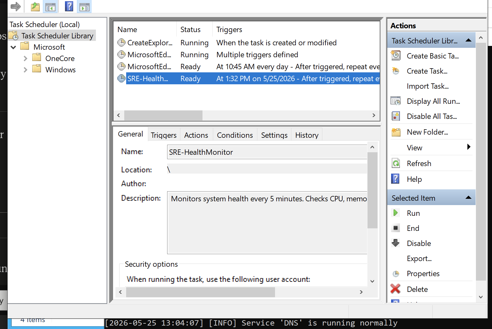
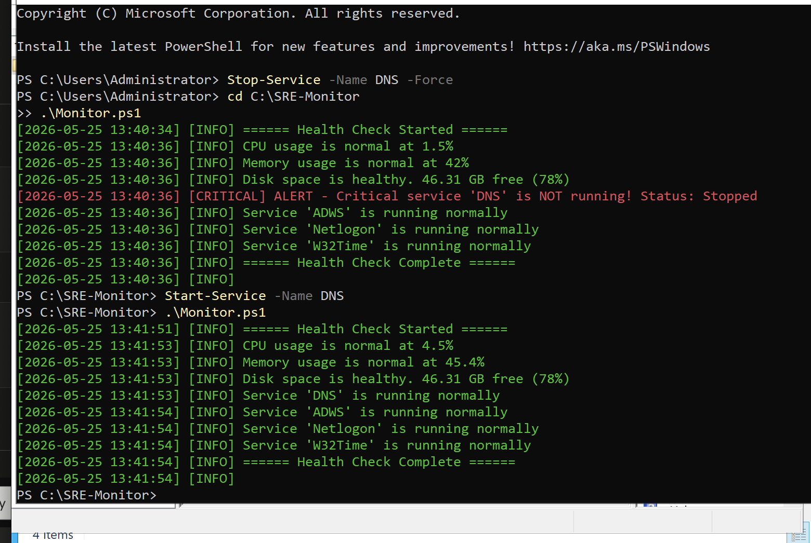

# SRE-System-Health-Monitor

A production-inspired Site Reliability Engineering (SRE) monitoring tool 
built from scratch using PowerShell on Windows Server 2022. This project 
demonstrates core SRE concepts including automated health checks, threshold-based 
alerting, structured logging, and infrastructure-as-code deployment — the same 
principles used in enterprise tools like AWS CloudWatch, Datadog, and Grafana.

---

## What This Project Demonstrates

| SRE Concept | Implementation |
| :--- | :--- |
| **Automated Monitoring** | Runs every 5 minutes via Task Scheduler without human intervention |
| **Threshold Alerting** | Fires CRITICAL alerts when metrics exceed defined limits |
| **Structured Logging** | Every check timestamped and written to a persistent log file |
| **Infrastructure as Code** | Entire monitoring stack deployed with a single script |
| **Separation of Concerns** | Config, alerting logic, and monitoring logic in separate files |
| **Log Rotation** | Automatically purges entries older than 7 days |
| **Incident Detection** | Catches service outages in real time and logs exact failure state |

---

## Environment

| Component | Details |
| :--- | :--- |
| **Server OS** | Windows Server 2022 |
| **Domain** | `manar.local` |
| **Domain Controller** | `WIN-821SIA1ORE2` |
| **Hypervisor** | VMware Fusion (macOS) |
| **Scripting** | PowerShell 5.1 |

---

## Architecture

```
SRE-Monitor/
├── Setup-Monitor.ps1   ← one command deploys everything automatically
├── Config.ps1          ← all thresholds and settings in one place
├── Alert.ps1           ← logging and alerting functions
├── Monitor.ps1         ← main health check engine
└── Logs/
    └── health_log.txt  ← auto-generated, grows every 5 minutes
```


### Why This Structure?

**Separation of concerns** — a core DevOps principle. If alert thresholds 
change, only `Config.ps1` needs editing. If the logging format changes, only 
`Alert.ps1` needs updating. The monitoring logic in `Monitor.ps1` never needs 
to change for either. This is the same architecture behind enterprise 
monitoring tools — configuration separate from logic separate from alerting.

---

## What It Monitors

| Check | Metric | Default Threshold | Alert Level |
| :--- | :--- | :--- | :--- |
| **CPU Usage** | Average across all cores | > 80% | CRITICAL |
| **Memory Usage** | Percentage of RAM used | > 85% | CRITICAL |
| **Disk Space** | Free space on C: drive | < 10% free | CRITICAL |
| **DNS Service** | Windows DNS Server service | Stopped | CRITICAL |
| **ADWS** | Active Directory Web Services | Stopped | CRITICAL |
| **Netlogon** | Domain authentication service | Stopped | CRITICAL |
| **W32Time** | Windows Time service | Stopped | CRITICAL |

---

## Log Format

Every check produces a structured log entry:
[YYYY-MM-DD HH:MM:SS] [LEVEL] Message

Three severity levels:

| Level | Color | Meaning |
| :--- | :--- | :--- |
| `INFO` | Green | System is healthy |
| `WARNING` | Yellow | Something needs attention |
| `CRITICAL` | Red | Immediate action required |

---

## Screenshots

### Step 1: Setup Script Deployed
Running `.\Setup-Monitor.ps1` installs the entire monitoring stack automatically.
The script verifies all files are present, creates the scheduled task, and 
starts monitoring immediately — all in one command.



---

### Step 2: Automated Health Checks Running
The log file confirms the monitor is running every 5 minutes automatically 
without any manual intervention. Multiple timestamped health check cycles 
are visible proving continuous unattended operation.



---

### Step 3: Scheduled Task Verified
The Task Scheduler GUI confirms `SRE-HealthMonitor` is registered and set 
to repeat every 5 minutes. The task runs under the SYSTEM account meaning 
it operates even when no user is logged into the server.



---

### Step 4: Real Infrastructure Failure Detected
The DNS service was deliberately stopped to simulate a real outage. The 
monitor instantly flagged it as CRITICAL while all other services continued 
reporting healthy — isolating the exact failing component.



The complete incident timeline:

| Time | Event |
| :--- | :--- |
| `13:40:36` | DNS outage detected — CRITICAL alert fired |
| `13:41:51` | `Start-Service DNS` executed to remediate |
| `13:41:53` | DNS confirmed running normally — incident closed |

This mirrors real SRE incident response: **detect → alert → remediate → verify.**

---

## Real-World Equivalents

| This Project | Enterprise Equivalent |
| :--- | :--- |
| `Config.ps1` thresholds | AWS CloudWatch alarm thresholds |
| `Alert.ps1` logging | Datadog log management |
| Task Scheduler every 5 min | AWS EventBridge scheduled rules |
| CRITICAL severity levels | PagerDuty alert priorities |
| `Setup-Monitor.ps1` | Ansible playbook / Terraform module |
| Log rotation | AWS CloudWatch log retention policies |
| Service health checks | AWS Route 53 health checks |

---

## Skills Demonstrated

- PowerShell scripting for infrastructure automation
- SRE monitoring and alerting design patterns
- Threshold-based health check implementation
- Structured logging with severity levels
- Windows Task Scheduler automation via code
- Infrastructure as Code deployment scripting
- `Get-CimInstance` WMI queries for system metrics
- Multi-core CPU averaging with `Measure-Object`
- Service state monitoring with `Get-Service`
- Incident simulation and recovery verification
- Separation of configuration, logic, and alerting concerns
- Log rotation and file management automation
